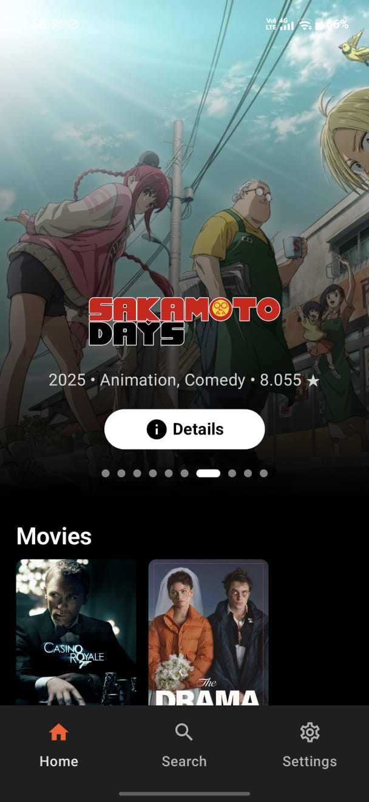
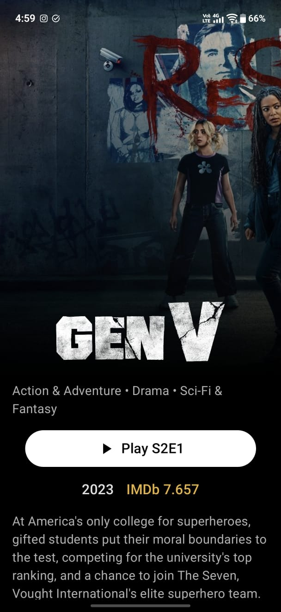
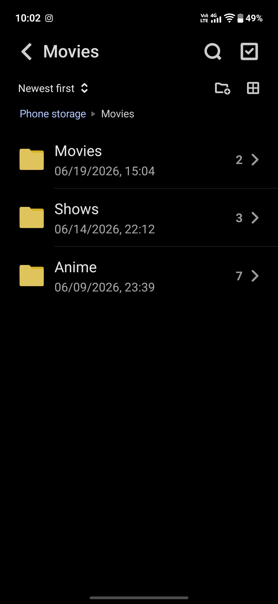
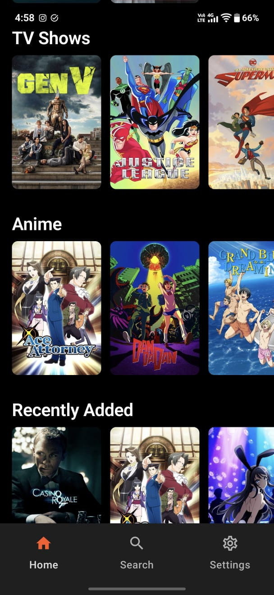
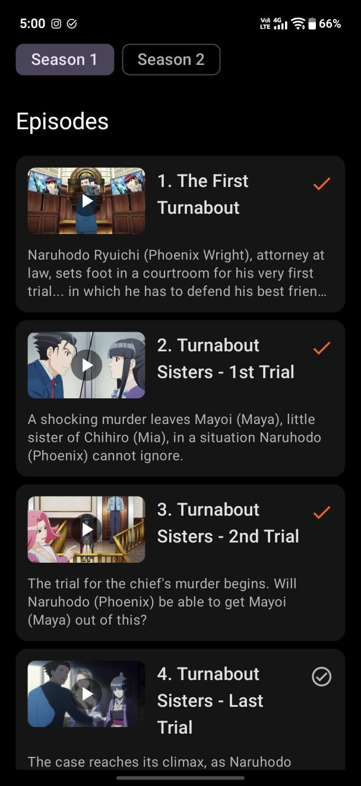
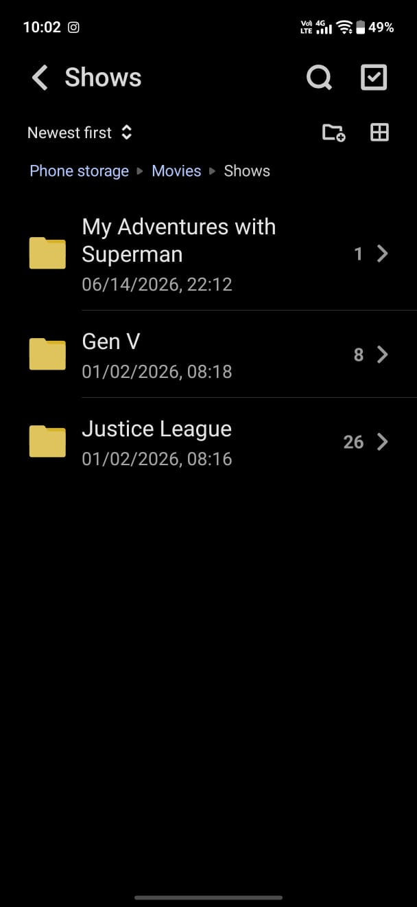

# LionLibrary

LionLibrary is simple a media manager app that displays your local media files in a beautiful interface with automatically fetched metadata. 
Note: The current version does NOT come with a built in media player (as of yet), so the app will automatically play files in your default video player. 

## Screenshots

| Home Screens | Detail Screens | Expected Directory |
| :---: | :---: | :---: |
|  |  |  |
|  |  |  |

## Setup Instructions

1. Open the app and go to the Settings screen.
2. Enter your TMDB API Key. A free key can be created from the TMDB website
3. Select the local folders where your Movies, TV Shows, and Anime are stored.
4. Tap "Scan Library" to begin parsing filenames and fetching metadata.

## Tech Stack

LionLibrary is built with modern Android development practices, following Clean Architecture and MVI for the presentation layer.

* **Language:** Kotlin
* **UI:** Jetpack Compose, Material 3
* **Navigation:** Compose Navigation
* **Dependency Injection:** Koin
* **Database:** Room
* **Preferences:** DataStore
* **Networking:** Retrofit 2, OkHttp, Kotlinx Serialization
* **Image Loading:** Coil
* **Asynchronous Programming:** Kotlin Coroutines

## DISCLAIMER

THE APP DOES NOT CONTAIN OR STREAM ANY MEDIA CONTENT. IT ONLY ORGANIZES LOCAL MEDIA FILES. ALL THE CONTENT MUST BE PROVIDED BY THE USER.
