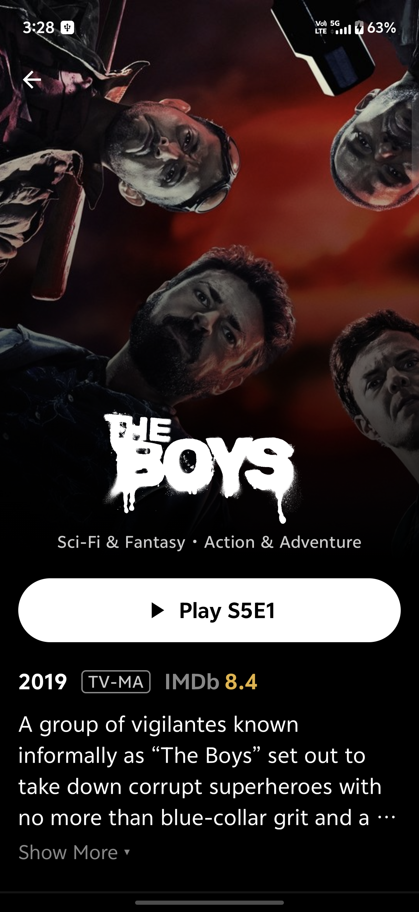
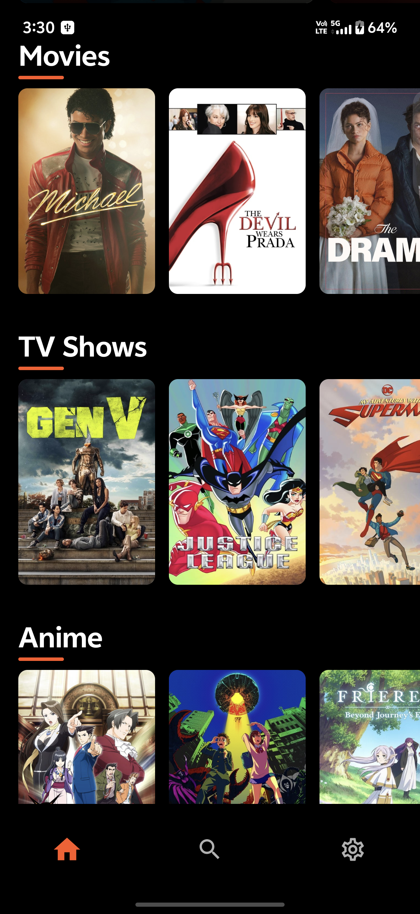
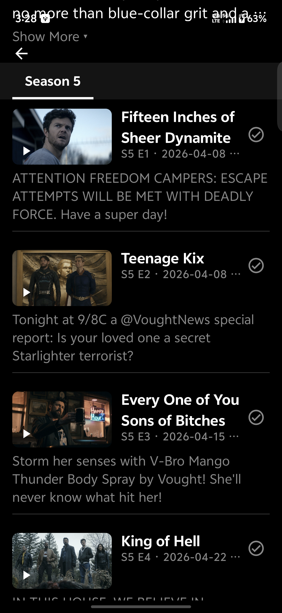

# LionLibrary

LionLibrary is an offline-first Android media manager and player. It organizes your local video files (Movies, TV Shows, Anime) into a browsable interface and automatically fetches metadata and artwork.

## Screenshots

| Home Screens | Detail Screens |
| :---: | :---: |
|  |  |
|  |  |

## Features

* **Built-in Video Player:** Plays files directly in the app. Uses ExoPlayer by default, with a libVLC fallback for unsupported formats. You can also hand off playback to an external player.
* **Offline-First:** Once you scan your library, all metadata and images are cached locally. You don't need an internet connection to browse or play your media.
* **Watch Progress:** Tracks what you've watched. The "Jump Back In" section lets you resume episodes right where you left off.
* **Smart Scanning:** Parses your folder names to group seasons and identify content using TMDB.

## Setup Instructions

1. Open the app and go to the Settings screen.
2. Enter your TMDB API Key. You can get a free key from the TMDB website.
3. Select the local folders where your Movies and TV Shows/Anime are stored.
4. Tap "Scan Library" to parse your files and download metadata.

## Tech Stack

LionLibrary uses Clean Architecture and MVI.

* **Language:** Kotlin
* **UI:** Jetpack Compose, Material 3
* **Core:** Koin, Room, DataStore
* **Networking & Media:** Retrofit 2, Coil, Media3 ExoPlayer, libVLC

## Credits

* This product uses the TMDB API but is not endorsed or certified by TMDB.
* Video playback is powered by ExoPlayer and libVLC.
* Design heavily inspired by Nuvio

See [NOTICE.md](./NOTICE.md) for third-party licenses and attributions.

## DISCLAIMER

THE APP DOES NOT CONTAIN OR STREAM ANY MEDIA CONTENT. IT ONLY ORGANIZES LOCAL MEDIA FILES. ALL THE CONTENT MUST BE PROVIDED BY THE USER.
